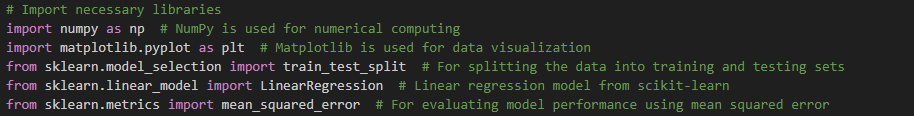
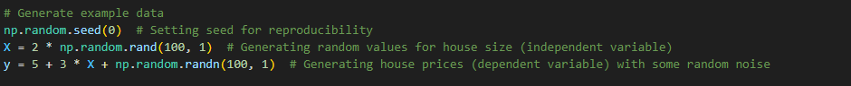
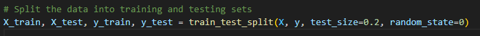
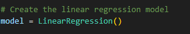
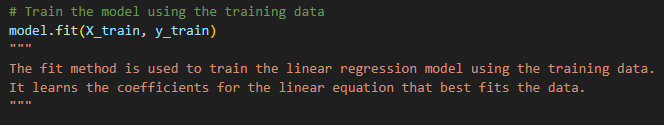
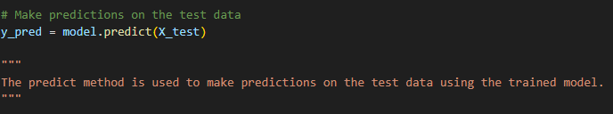
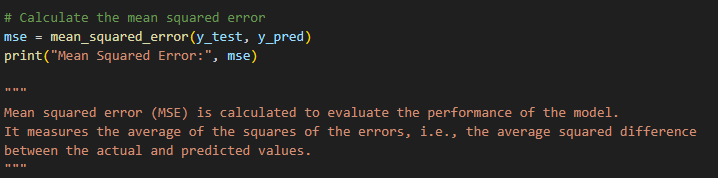
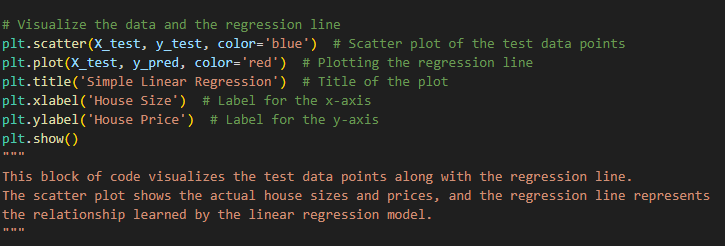

## Importing Libraries

- **numpy (np)**: Used for numerical computing.
- **matplotlib.pyplot (plt)**: Utilized for data visualization.
- **train_test_split**: Function from scikit-learn for splitting data into training and testing sets.
- **LinearRegression**: Class from scikit-learn implementing linear regression.
- **mean_squared_error**: Function from scikit-learn for evaluating model performance.

## Generate Example Data
- Generates example data for demonstrating linear regression:
  - Sets a seed for reproducibility.
  - Generates random values for house size (independent variable) and house prices (dependent variable) with some random noise.

## Split Data
- Splits the generated data into training and testing sets:
  - Utilizes `train_test_split` function to divide the data.
  - Specifies that 20% of the data will be used for testing and 80% for training.
  - Sets a random seed for reproducibility.

## Create Model
- Initializes a linear regression model using the `LinearRegression` class.

## Train Model
- Trains the linear regression model using the training data:
  - Uses the `fit` method to fit the model to the training data.

## Make Predictions
- Uses the trained model to make predictions on the test data:
  - Uses the `predict` method to predict the dependent variable based on the independent variable in the test dataset.

## Calculate Error
- Calculates the mean squared error (MSE) to evaluate the performance of the model:
  - Computes the MSE between the actual and predicted values of the dependent variable.

## Visualize Results
- Visualizes the test data and the regression line:
  - Creates a scatter plot of the test data points.
  - Plots the regression line based on the predictions against the test data.
  - Sets title, x-axis label, and y-axis label for the plot.
  - Displays the plot.
