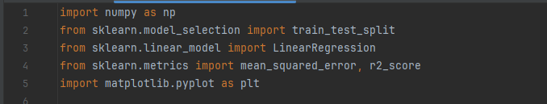
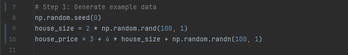
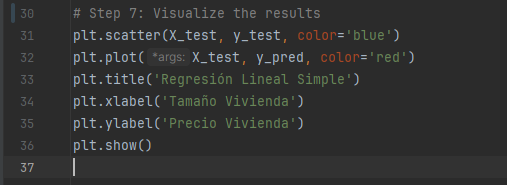

## Importación de Librerías

- **Numpy (np)**: Es una biblioteca fundamental para la computación cientifica en Python. Proporciona soporte para matrices multidimensionales, junto con una amplia variedad de funciones matemáticas.
- **scikit-learn (sklearn)**: Scikit-learn es una biblioteca de aprendizaje automático (machine learning) para Python que proporciona herramientass simples y eficientes para el análisis predictivo de datos. Incluye una variedad de algoritmos de aprendizaje supervisado y no supervisado.
- **matplotlib.pyplot (plt)**: Matplotlib es una biblioteca de visualización en Python que se utilizz comúnmente para crear gráficos estáticos, graficos interactivos y visuallizaciones de datos. 

## Generacion de datos de ejemplo

- **np.random.seed(0)**: Establece la semilla para el generador de números aleatorios de NumPy. 
- **tamano_vivienda**: Representa la variable independiente del modelo.
- **precio_vivienda**: Representa la varaible dependiente del modelo, es decir cambiara en funcion a la variable independiente.

## Dividir los datos en conjuntos de entrenamiento y prueba

- **train_test_split**: Divide un conjunto de datos en conjuntos de entrenamiento y prueba.
- **test_size**: Especifica el tamaño que tendrá el conjunto de prueba. Es decir el porcentaje de datos que se utilizaran como conjunto de prueba y el restante como conjunto de entrenamiento.
- **random_state**: Esto establece la semilla para el generador de números aleatorios que se utiliza internamente en la funcion. Misma semilla representa que se obtendran los mismos datos en caso de replicar.
- **X_train**: Variables independientes de entrenamiento.
- **X_test**: Variables independientes de prueba.
- **Y_train**: Variables dependientes de entrenamiento.
- **Y_test**: Variables dependientes de prueba.

## Crear y entrenar el modelo (Regresion Lineal)

- **model = LinearRegression()**: Esto crea una instancia del modelo de regresión lineal.
- **model.fit()**: Esta linea de codigo entrena el modelo utilizando los datos de entrenamiento. El método 'fit()' ajusta el modelo a los datos de entrenamiento, es decir, encuentra los coeficientes óptimos para la línea o hiperplano.

## Hacer predicciones

- **model.predict()**: Utiliza el metodo 'predict()' del modelo de regresión lineal ('model') para realizar predicciones sobre los valores independientes de prueba (X_test)
- **y_pred**: Las predicciones resultantes se asignan a la variable 'y_pred'. 

## Calcular el error cuadrático medio

- **mean_squared_error()**: Este es un método de la biblioteca scikit-learn (sklearn) que calcula el Error Cuadrático Medio (MSE) entre los valores reales dependendientes del conjunto de prueba y las predicciones del modelo.
- **mse**: EL valor del MSE se almacena en esta variable.

## Calcular el coeficiente de determinación

- **r2_score**: Este es un método de la biblioteca scikit-learn que calcula el Coeficiente de Determinacion (R-Cuadrado), esta es una medida de qué tan bien las predicciones del modelo se ajustan a los datos reales y varía entre 0 y 1. Entre más cercano a 1 indica un mejor ajuste del modelo a los datos.
- **r2**: Almacena el valor del Coeficiente de Determinación

## Visualizar los resultados

- **plt.scatter**: Este comando traza un diagrana de dispersión de los datos de prueba. Cada punto en el grafico representa una observación del conjunto de prueba, el eje x siendo el tamaño de la vivienda y el eje y el precio de la vivienda.
- **plt.plot**: Este comando traza la línea de regresión lineal sobre los datos de prueba. 
- **plt.title()**: Este comando establece el título del gráfico.
- **plt.xlabel()**: Este comando establece la etiqueta del eje x.
- **plt.ylabel()**: Este comando establece la etiqueta del eje y.
- **plt.show()**: Este comando muestra el gráfico completo con todas las caracteristicas configuradas.

