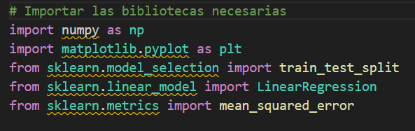
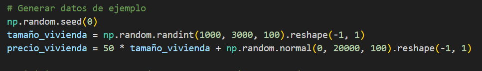
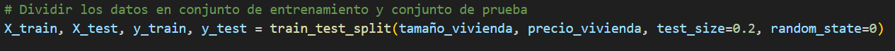
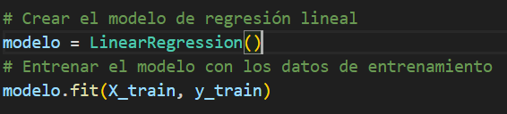
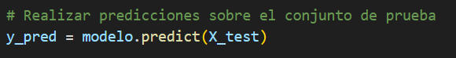
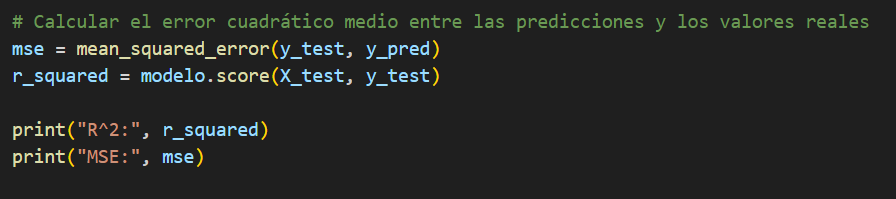
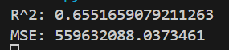
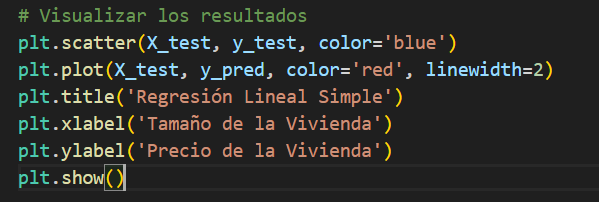
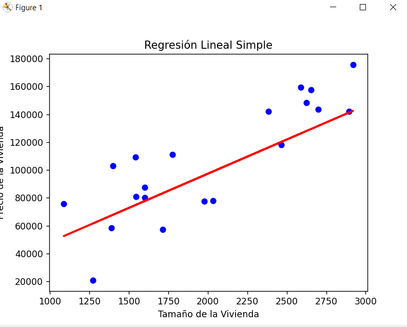

<h1> Regresion lineal con Python y ChatGPT</h1>

<h2>1- Importación de bibliotecas</h2>

- `import numpy as np`: La biblioteca NumPy bajo el alias `np`. NumPy es una biblioteca fundamental para computación numérica en Python y se utiliza comúnmente para manipular matrices y realizar cálculos numéricos.

- `import matplotlib.pyplot as plt`: Es una subbiblioteca `pyplot` de Matplotlib bajo el alias `plt`. Matplotlib es una biblioteca de visualización en Python que se utiliza para crear gráficos y visualizaciones.

- `from sklearn.model_selection import train_test_split`: La función `train_test_split` de `sklearn.model_selection`. Esta función se utiliza para dividir los datos en conjuntos de entrenamiento y prueba.

- `from sklearn.linear_model import LinearRegression`: La clase `LinearRegression` de `sklearn.linear_model`. Esta clase implementa un modelo de regresión lineal.

- `from sklearn.metrics import mean_squared_error`: La función `mean_squared_error` de `sklearn.metrics`. Esta función se utiliza para calcular el error cuadrático medio entre las predicciones y los valores reales.
 

<h2>2- Generar datos random</h2>

- `np.random.seed(0)`: Esta línea establece la semilla del generador de números aleatorios de NumPy en 0. Establecer la semilla garantiza que los números aleatorios generados sean los mismos en cada ejecución del código.

- `tamaño_vivienda = np.random.randint(1000, 3000, 100).reshape(-1, 1)`: Genera un conjunto de 100 números enteros aleatorios entre 1000 y 3000 (ambos inclusive) que representan el tamaño de las viviendas. Estos números se almacenan en una matriz unidimensional y luego se convierten en una matriz bidimensional con una sola columna utilizando el método `reshape(-1, 1)`.

- `precio_vivienda = 50 * tamaño_vivienda + np.random.normal(0, 20000, 100).reshape(-1, 1)`: Calcula el precio de las viviendas utilizando una relación lineal con el tamaño de las viviendas. Se multiplica cada tamaño de vivienda por 50 y se suma un término de error generado a partir de una distribución normal con media 0 y desviación estándar de 20,000.

 

<h2>3- Dividir los datos en conjunto de entrenamiento y conjunto de prueba</h2>

Este código divide los datos en conjuntos de entrenamiento y prueba utilizando la función `train_test_split` de la biblioteca `scikit-learn` (sklearn). Aquí está el análisis del código:

- `train_test_split(tamaño_vivienda, precio_vivienda, test_size=0.2, random_state=0)`: Esta función toma como entrada las características (`tamaño_vivienda`) y las etiquetas (`precio_vivienda`) y divide los datos en cuatro conjuntos: características de entrenamiento (`X_train`), características de prueba (`X_test`), etiquetas de entrenamiento (`y_train`), y etiquetas de prueba (`y_test`).

    - `tamaño_vivienda`: Es el conjunto de características que representa el tamaño de las viviendas.
    
    - `precio_vivienda`: Es el conjunto de etiquetas que representa los precios de las viviendas.
    
    - `test_size=0.2`: Indica que el 20% de los datos se utilizarán como conjunto de prueba, mientras que el 80% restante se utilizará como conjunto de entrenamiento.
    
    - `random_state=0`: Establece la semilla para el generador de números aleatorios utilizado internamente por la función. Esto asegura que la división de los datos sea reproducible; es decir, si ejecutas este código varias veces con la misma semilla, obtendrás la misma división de los datos.

Después de ejecutar este código, tendrás cuatro conjuntos de datos: `X_train` (características de entrenamiento), `X_test` (características de prueba), `y_train` (etiquetas de entrenamiento) y `y_test` (etiquetas de prueba). Estos conjuntos se utilizan para entrenar un modelo de regresión lineal y evaluar su rendimiento en datos no vistos.

 

<h2>4- Crear el modelo de regresión lineal</h2>

- `modelo = LinearRegression()`: Esta línea crea una instancia de la clase `LinearRegression`, que representa el modelo de regresión lineal.

- `modelo.fit(X_train, y_train)`: Luego, se utiliza el método `fit` del objeto del modelo (`modelo`) para entrenarlo con los datos de entrenamiento. Este método ajusta el modelo a los datos de entrenamiento proporcionados. 

    - `X_train`: Son las características de entrenamiento, es decir, el tamaño de las viviendas.
    
    - `y_train`: Son las etiquetas de entrenamiento, es decir, los precios de las viviendas correspondientes a las características de entrenamiento.

 

<h2>5- Realizar predicciones sobre el conjunto de prueba</h2>

    En este bloque de código, se realizan predicciones sobre el conjunto de prueba utilizando el modelo de regresión lineal previamente entrenado.
- `y_pred = modelo.predict(X_test)`: Utilizando el método `predict` del objeto del modelo (`modelo`), se hacen predicciones sobre las características de prueba (`X_test`). Este método utiliza el modelo entrenado para predecir las etiquetas correspondientes a las características de prueba.

    - `X_test`: Son las características de prueba, es decir, el tamaño de las viviendas para las cuales se desea predecir el precio.

El resultado de estas predicciones se almacena en la variable `y_pred`. Estas predicciones pueden ser comparadas con las etiquetas reales (`y_test`) para evaluar el rendimiento del modelo.

 

<h2>6- Calcular el error cuadrático medio y el coeficiente de diferenciación</h2>

    En este bloque de código, se calcula el error cuadrático medio (MSE) y el coeficiente de determinación (R^2) entre las predicciones y los valores reales utilizando el modelo de regresión lineal entrenado.

- `mse = mean_squared_error(y_test, y_pred)`: Se utiliza la función `mean_squared_error` para calcular el error cuadrático medio entre las etiquetas reales (`y_test`) y las predicciones (`y_pred`). Este valor representa la cantidad promedio por la cual las predicciones del modelo difieren de los valores reales al cuadrado.

- `r_squared = modelo.score(X_test, y_test)`: Se utiliza el método `score` del modelo (`modelo`) para calcular el coeficiente de determinación (R^2) entre las características de prueba (`X_test`) y las etiquetas de prueba (`y_test`). El coeficiente de determinación es una medida de la calidad de las predicciones del modelo y varía entre 0 y 1, donde 1 indica una predicción perfecta y 0 indica que el modelo no es mejor que simplemente predecir la media de las etiquetas.

*Estos son los resultados mostrados por consola:*

 

<h2>7- Visualizar los resultados</h2>

En este bloque de código, se visualizan los resultados de la regresión lineal utilizando un gráfico de dispersión y la línea de regresión.

- `plt.scatter(X_test, y_test, color='blue')`: Se utiliza la función `scatter` para graficar las características de prueba (`X_test`) en el eje x y las etiquetas de prueba (`y_test`) en el eje y. Estos puntos se muestran en color azul.

- `plt.plot(X_test, y_pred, color='red', linewidth=2)`: Se utiliza la función `plot` para graficar la línea de regresión. Las características de prueba (`X_test`) se utilizan en el eje x y las predicciones (`y_pred`) se utilizan en el eje y. La línea se muestra en color rojo con un ancho de línea de 2.

- `plt.title('Regresión Lineal Simple')`: Se establece el título del gráfico como "Regresión Lineal Simple".

- `plt.xlabel('Tamaño de la Vivienda')`: Se etiqueta el eje x como "Tamaño de la Vivienda".

- `plt.ylabel('Precio de la Vivienda')`: Se etiqueta el eje y como "Precio de la Vivienda".

- `plt.show()`: Muestra el gráfico.

 

<h2>8- Analizar los datos obtenidos de la grafica de regresión linea</h2>

La regresion lineal se conoce como un método estadistico para modelar la relacion entre una variable dependiente y una o mas variables independientes. 
* `variable dependiente`: Es la variable que se trata de predecir o explicar en un modelo. Es la variable que se modela como una función de una o más variables independientes. Por ejemplo, si estamos construyendo un modelo para predecir el precio de una casa basado en su tamaño, el precio de la casa sería la variable dependiente, ya que es lo que estamos tratando de predecir. 
* `variable independiente`: Es una variable que se utiliza para predecir o explicar la variabilidad en la variable dependiente en un modelo estadístico o matemático. Por ejemplo, como se mencionaba el ejemplo del precio de la casa y el tamaño de la casa sería una variable independiente que se utiliza para predecir el precio.

Lo que significa en la grafica las figuras son:
- `La linea roja`: Esta representa la relación estimada entre la variable independiente y la variable dependiente. Esta línea se ajusta a los datos y se utiliza para hacer predicciones sobre los valores de la variable dependiente basados en los valores de la variable independiente.
- `Los puntos azules`:Representan los datos observados en el conjunto de datos original. Cada punto corresponde a un par de valores de la variable independiente y la variable dependiente.

    En el contexto de la regresión lineal, estos puntos representan la relación entre la variable independiente (eje x) y la variable dependiente (eje y) tal como se observa en los datos reales.

 

<h2>Referencias Bibliográficas</h2>

* OpenAI. (2024). Desarrollo de inteligencia artificial avanzada: Una mirada a GPT-3.5 [Resumen]. Recuperado de https://www.openai.com/gpt-3.5-development/