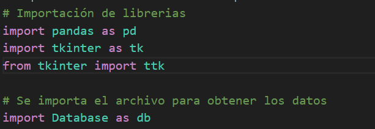

# **Documentación del Funcionamiento y Diseño de la Aplicación**

## **Reglas del Motor de Inferencia**

- Si hay manchas oscuras en hojas y frutos y pudricion entonces hay antracnosis.
- Si hay manchas oscuras en frutos y pudricion acuosa entonces hay podredumbre negra.
- Si hay manchas negras en hojas y reduccion de area foliar entonces hay sigatoka negra.
- Si hay manchas negras en frutos y hojas y defoliacion entonces hay mancha de asfalto.
- Si hay manchas negras en hojas y deformacion de hojas y frutos entonces hay mancha negra.
- Si hay manchas amarrilas o marrones en hojas y formacion de lesiones entonces hay mancha angular.
- Si hay marchitez, necrosis del cogollo y hojas sin abrir entonces hay pudricion del cogollo.
- Si hay marchitez, decoloracion en tallos y raices y perdida de vigor entonces hay marchitez por fusarium.
- Si hay marchitez, decoloracion en tallos y raices entonces hay fusariosis.
- Si hay pustulas naranjas y defoliacion entonces hay roya del cafe.
- Si hay patrones mosaico hojas y deformacion de hojas y frutos entonces hay Virosis.
- Si hay polvo blanco o gris en hojas y deformidad en tallos entonces hay oidio.

Estas reglas se procesaron para expresarlas como una lista de objetos en un formato [JSON](resources/reglas.json).

## **Diseño del Motor de Inferencia**

### Importación de Librerías y Base de Datos

- **pandas**: libreria para el manejo de datos, en particular para leer archivos Excel.
- **tkinter**: liberia para la creación de la interfaz gráfica.
- **ttk**: libería para utilizar widgets mejorados de tkinter.

- Se importa el archivo **Database.py**, el cual contiene funciones para obtener las reglas de diagnóstico (base de conocimiento).

### Lectura del Archivo de Pruebas en Excel

- Se lee el archivo de pruebas en Excel llamado [entradas_plantas](entradas_plantas.xlsx) y se almacena en un DataFrame (estructura de datos bidimensional) utilizando la librería **pandas**, con el fin de obtener las entradas a evaluar por el motor de inferencia. Los diagnósticos de enfermedades esperados de las pruebas son los siguientes:

    1. Virosis
    2. Mancha Negra
    3. Sikatoka Negra
    4. Oidio
    5. Roya del Cafe
    6. Mancha Angular
    7. Antracnosis
    8. Pudricion del Cogollo

### Función del Motor de Inferencias

- Se define la función **motor_inferencias()** que realiza el proceso de inferencia para diagnosticar enfermedades en plantas basado en las reglas establecidas y una entrada. Básicamente el motor de inferencias toma cada regla y evalua si la entrada cumple con los síntomas de la misma con el fin de diagnosticar la enfermedad en la entrada. La función, en caso de diagnosticar alguna enfermedad, retorna las enfermedades diagnosticadas con su respectiva explicación.

### Creación del UI para Mostrar los Diagnósticos

- Se crea una ventana principal **root** utilizando tkinter.

- Se crea una tabla utilizando **ttk.Treeview** para mostrar los diagnósticos resultantes. La tabla tiene tres columnas: "Entrada", "Diagnóstico" y "Explicación".

### Iteración Sobre las Entradas y Mostrar los Diagnósticos en la Tabla

- Se itera sobre las entradas del DataFrame **df** y se aplica el motor de inferencias a cada una para obtener los diagnósticos y explicaciones correspondientes. Luego, se insertan los diagnósticos en la tabla. La función **db.obtener_lista_reglas()** retorna las reglas almacenadas en la base de datos correspondiente.

### Código para Cerrar y Ejecutar la Aplicación

- Se crea un botón "Cerrar" que, al hacer clic, llama a la función **cerrar_app()** para cerrar la aplicación.

- Se ejecuta el bucle de eventos principal (**mainloop()**) de tkinter para mostrar la interfaz gráfica y permitir la interacción del usuario.

