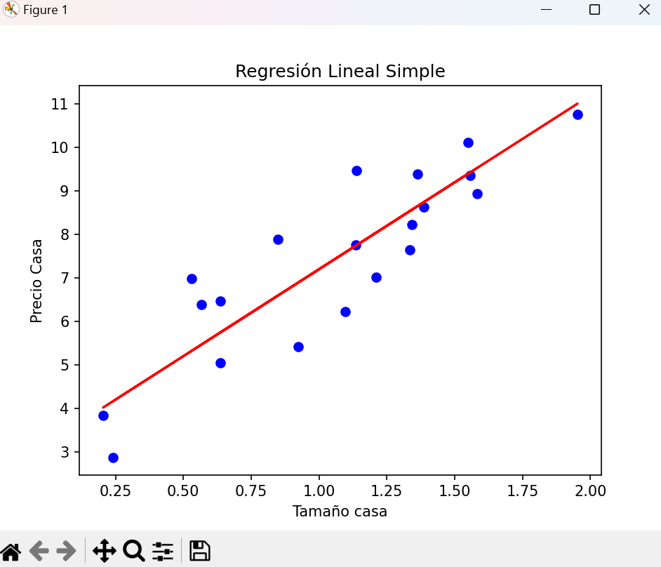

## 1. Importar las bibliotecas

- **numpy**: Utilizada para trabajar con matrices y operaciones numéricas.
- **train_test_split**: Para dividir el conjunto de datos en conjuntos de entrenamiento y prueba.
- **LinearRegression**: Para crear y entrenar un modelo de regresión lineal.
- **mean_squared_error**: Para calcular el error cuadrático medio (MSE).
- **matplotlib.pyplot**: Para visualizar los datos y el modelo.

## 2. Generar datos de ejemplo

.

En este paso, generamos datos de ejemplo para demostrar el funcionamiento del modelo de regresión lineal. Utilizamos la función np.random.rand() para generar números aleatorios entre 0 y 1 y los multiplicamos por 2 para obtener números entre 0 y 2. Luego, utilizamos la ecuación de una línea con pendiente 4, una intersección con el eje y de 3 y agregamos un poco de ruido gaussiano utilizando np.random.randn().

## 3. Dividir los datos en conjuntos de entrenamiento y prueba

Aquí dividimos los datos en dos conjuntos: uno para entrenar el modelo y otro para evaluar su rendimiento. Utilizamos la función train_test_split para hacer esto. Definimos que el 20% de los datos se utilizarán para pruebas y el resto para entrenamiento.

## 4. Crear y entrenar el modelo de regresión lineal
.

Creamos un objeto de modelo de regresión lineal utilizando la clase LinearRegression de scikit-learn. Luego, entrenamos el modelo utilizando los datos de entrenamiento (X_train y y_train) utilizando el método fit().

## 5. Hacer predicciones
.

Utilizamos el modelo entrenado para hacer predicciones sobre los datos de prueba (X_test) utilizando el método predict().

## 6. Calcular el error cuadrático medio y el coeficiente de determinación (R^2)

Calculamos el error cuadrático medio (MSE) comparando las etiquetas verdaderas (y_test) con las predicciones del modelo (y_pred) utilizando la función mean_squared_error(). Además, calculamos el coeficiente de determinación ($R^2$) utilizando el método score() del modelo. Ambas métricas se utilizan para evaluar el rendimiento del modelo.

## 7. Observar los resultados

Finalmente, visualizamos los resultados. Graficamos los datos de prueba (X_test, y_test) como puntos azules en un gráfico de dispersión y trazamos la línea de regresión lineal predicha (X_test, y_pred) en rojo. Esto nos permite visualizar cómo se ajusta el modelo a los datos de prueba.

## Gráfica

